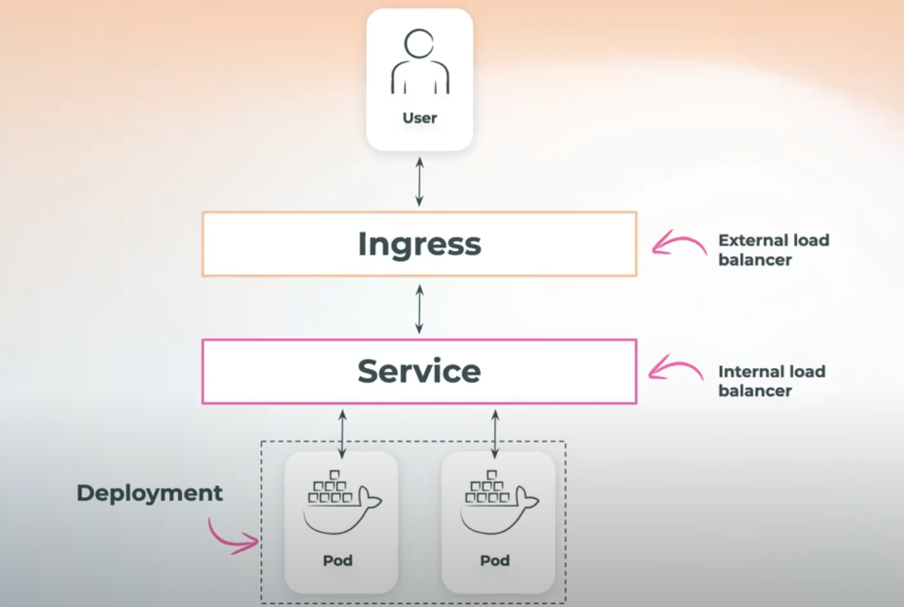

## Step by Step Guide

Please below a step by step guide of how to deploy a docker image to a k8 cluster.

### Prerequisite
Create a namespace

        kubectl create namespace django

### Local Dev
- Create a docker image and maybe push to dockerhub for later use.
- Before deploying a deployment, you can test the image and run a container to check everything is fine: 

        docker run -p 8080:<container_port> <image_name>

### Pod
- Create pod and check pod logs:

        kubectl apply -f pod.yaml
        kubectl logs <pod-name>
- You can do a port forwarding to test your pod from outside the cluster: 
    
        kubectl port-forward pod/<pod-name> 8082:<container_port>

### Deployment
- Create deployment and describe it to see events and verify if there are any errors: 

        kubectl apply -f deployment.yaml
        kubectl describe deployment.apps <deployment-name>

### Service
- Create servcie

        kubectl apply -f service.yaml
#### Types of services

- ClusterIP: The service is used for Pod-to-Pod communication within the same cluster. This means that a client running outside of the cluster, such as a user accessing an application over the internet, cannot directly access a ClusterIP Service.
- NodePort: The service provides a way to expose your application to external clients. An external client is anyone who is trying to access your application from outside of the Kubernetes cluster. The NodePort Service does this by opening the port you choose (in the range of 30000 to 32767) on all worker nodes in the cluster. So, if the nodePort is set to 30020, for example, anyone who wants to use your app can just connect to any worker node’s IP address on port 30020, and voila! They're in. One disadvantage of the NodePort Service is that it doesn't do any kind of load balancing across multiple nodes. It simply directs traffic to whichever node the client connected to. This can create a problem: Some nodes can get overwhelmed with requests while others sit idle.
- LoadBalancer: A service is another way you can expose your applications to external clients. However, it only works if you're using Kubernetes on a cloud platform that supports this Service type.

**NB**: If service type is omitted, a ClusterIP service is created by default.

- If curl is installed on the image, you can ssh onto any of the pods and curl the service: 

        kubectl exec –it pod/<pod-name> – sh
- You can do a port forwarding to test your service from outside the cluster (remember when using ClusterIP): 

        kubectl port-forward service/<service-name> <any_port>>:<service_port>

### Ingress
- An Ingress may be configured to give Services externally-reachable URLs, load balance traffic, terminate SSL / TLS, and offer name-based virtual hosting.
    - Prerequisite: Create an ingress controller:

            kubectl apply -f https://raw.githubusercontent.com/kubernetes/ingress-nginx/main/deploy/static/provider/cloud/deploy.yaml

